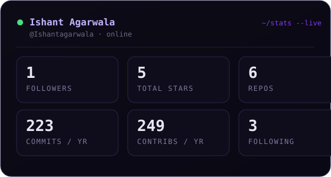

<div align="center">

<!-- ANIMATED HEADER BANNER -->


</div>

<!-- TYPING ANIMATION -->
<p align="center">
  
</p>

<!-- SOCIAL BADGES -->
<p align="center">
  <a href="https://linkedin.com/in/ishantagarwala" target="_blank">
    
  </a>&nbsp;
  <a href="https://career-wallah.vercel.app" target="_blank">
    
  </a>&nbsp;
  <a href="https://learnlens-nu.vercel.app" target="_blank">
    
  </a>&nbsp;
  <a href="mailto:Ishantagarwala@gmail.com">
    
  </a>
</p>

<!-- PROFILE VIEWS COUNTER -->
<p align="center">
  
</p>

<br/>

<!-- ANIMATED BOOT TERMINAL -->
<div align="center">
  
</div>

<br/>

---

<!-- ABOUT ME SECTION -->

<table>
<tr>
<td valign="top" width="55%">

### hi, I'm Ishant. I build backends that ship. 👋

```yaml
name: Ishant Agarwala
alias: Ishantagarwala
location: India

what I do:
  - build reliable backend systems
  - design automation workflows
  - ship AI-driven applications
  - collaborate on hackathon builds that matter

focus:
  - Python, APIs, scalable architecture
  - AI integrations & practical ML workflows

currently:
  - Career Pilot — AI career guidance
  - LearnLens — classroom mentoring diagnostics
  - always iterating on the next production build
```

</td>
<td valign="top" width="45%" align="center">
<br/>

</td>
</tr>
</table>

<br/>

---

<!-- ABOUT HIGHLIGHTS -->

## 🎯 what I'm about

<table>
  <tr>
    <td>⚙️</td>
    <td><b>Backend systems</b> &nbsp; APIs, services, and automation that hold up in production.</td>
  </tr>
  <tr>
    <td>🤖</td>
    <td><b>AI integrations</b> &nbsp; practical AI/ML workflows — not demos that die after the pitch.</td>
  </tr>
  <tr>
    <td>🚀</td>
    <td><b>Hackathon builder</b> &nbsp; Career Pilot for Brainware AI Hackathon 2026. ship first, polish next.</td>
  </tr>
  <tr>
    <td>🧠</td>
    <td><b>Always learning</b> &nbsp; scalable backend architecture and AI-driven product workflows.</td>
  </tr>
  <tr>
    <td>💬</td>
    <td><b>Ask me about</b> &nbsp; Python, backend logic, automation, and problem-solving.</td>
  </tr>
</table>

<br/>

---

<!-- TECH STACK -->

## 🛠️ the stack

<p align="center">
  <br/>
  <br/>
  <br/>
  
</p>

<br/>

---

<!-- PROJECTS -->

## 🚀 shipped

<table>
  <tr>
    <td width="50%" valign="top">
      <h3>🧭 Career Pilot &nbsp; <sub>AI career guidance</sub></h3>
      <sub>
        
        
        
        
      </sub>
      <br/><br/>
      AI-powered career guidance and learning assistant — interest profiling, personalized roadmaps, course curation, PDF analysis, and a 24/7 AI tutor. Built for Brainware AI Hackathon 2026.
      <br/><br/>
      <a href="https://github.com/Ishantagarwala/CareerPliot">
        
      </a>
      <a href="https://career-wallah.vercel.app">
        
      </a>
    </td>
    <td width="50%" valign="top">
      <h3>🔬 LearnLens &nbsp; <sub>mentoring diagnostics</sub></h3>
      <sub>
        
        
        
        
      </sub>
      <br/><br/>
      Web-based classroom mentoring diagnostic for programming courses. Teachers create cohorts, share surveys, and review rule-based mentoring tiers — with optional ML insights.
      <br/><br/>
      <a href="https://github.com/Ishantagarwala/LearnLens">
        
      </a>
      <a href="https://learnlens-nu.vercel.app">
        
      </a>
    </td>
  </tr>
  <tr>
    <td width="50%" valign="top" colspan="2">
      <h3>💪 fitnessdarji &nbsp; <sub>fitness app</sub></h3>
      <sub>
        
      </sub>
      <br/><br/>
      Fitness-focused web project — tracking and tooling for training workflows.
      <br/><br/>
      <a href="https://github.com/Ishantagarwala/fitnessdarji">
        
      </a>
    </td>
  </tr>
</table>

<br/>

---

<!-- GITHUB STATS -->

## 📊 the numbers

<div align="center">
  
</div>

<br/>

<div align="center">
  
  
</div>

<br/>

<!-- ACTIVITY GRAPH -->

<div align="center">
  
</div>

<br/>

---

<!-- SNAKE CONTRIBUTION ANIMATION -->

## 🐍 a snake eating my contributions

<div align="center">
  <picture>
    <source media="(prefers-color-scheme: dark)" srcset="https://raw.githubusercontent.com/Ishantagarwala/ishantagarwala/output/github-contribution-grid-snake-dark.svg" />
    <source media="(prefers-color-scheme: light)" srcset="https://raw.githubusercontent.com/Ishantagarwala/ishantagarwala/output/github-contribution-grid-snake.svg" />
    
  </picture>
</div>

<br/>

---

<!-- FOOTER WAVE -->


<p align="center">
  <i>⚡ build reliable systems. ship practical solutions. iterate.</i>
</p>
